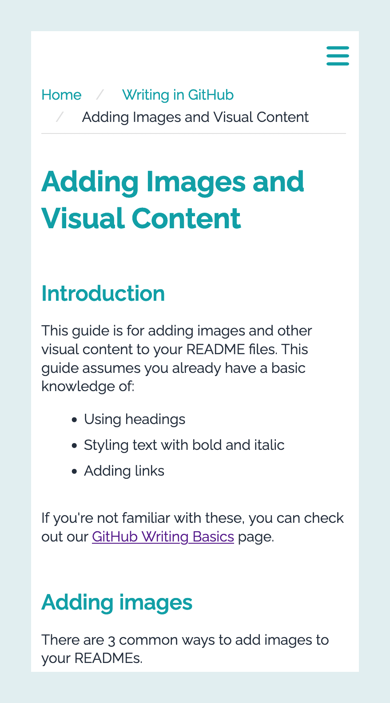
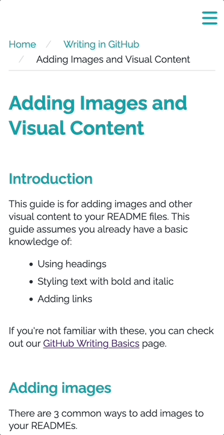
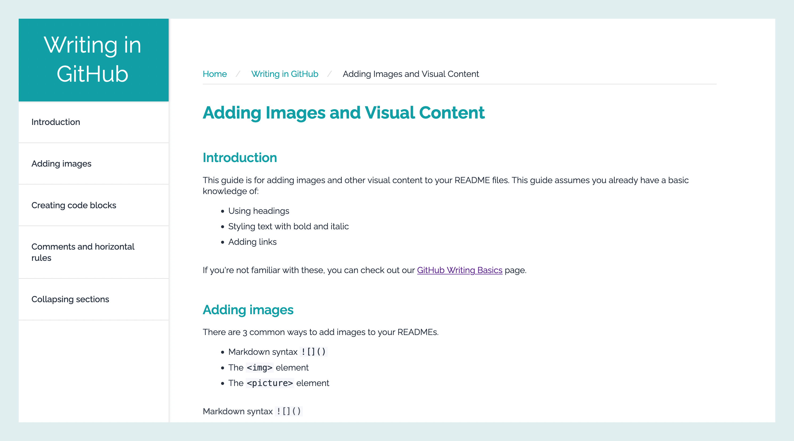

# Mobile-First Tech Doc with SASS

<div align="center">
  <picture>
    <source media="(max-width: 1199px)" srcset="./techdoc-mobile-bg.png"/>
    <source media="(min-width: 1200px)" srcset="./techdoc-desktop-bg.png"/>
    
  </picture>
  <p>Tech Doc Page</br><em><small>(on desktop, resize the browser window to see the mobile version)</small></em></p>
</div>

</br>

## Table of contents

- [Overview](#overview)
  - [Links](#links)  
  - [Highlights](#highlights)
- [Build details](#build-details)
  - [Features](#features)
  - [Challenges](#challenges)
  - [Continued development](#continued-development)
  - [Useful resources](#useful-resources)
- [Author](#author)

## Overview

For this project, I created a technical documentation page, focused on text content with example code blocks.

I wanted to challenge myself by creating the mobile version first, then expanding the design to fill the extra space on desktop. I also wanted to experiment with different navigation menu layouts, sliding in from the right on mobile and fixed on the left for desktop.

This project provided an opportunity to dig a little deeper into the capabilities of SASS, focusing on nesting rules and mixins.  

My build needed to fulfill the following:

- mobile-first design
- easily scannable text content written in plain language 
- example code blocks to support and clarify content
- collapsible mobile menu and fixed desktop menu versions

</br>

### Links

View live page: [SASS tech doc with mobile menu](https://rileydevdzn.github.io/sass-tech-doc/)

</br>

### Highlights

- Mobile-first design
  - [CSS-only mobile hamburger menu](#css-only-mobile-hamburger-menu)
- Semantic HTML5 markup
  - [multiple navigation options](#multiple-navigation-options)
- SASS
  - [variables and nested rules](#variables-and-nested-rules-in-sass)

</br>

</br>

## Build details

### Features

#### *CSS-only mobile hamburger menu*

For this design, I wanted to keep things simple and built the mobile navigation menu using just CSS.

I used a checkbox input and label for the mobile menu, represented by a hamburger icon. When the user taps the hamburger icon, the mobile nav menu slides in from the right of the page. I included a darkened background avoid the white-on-white overlay of the menu over content and help  focus attention on the nav menu. A second tap slides the mobile nav back to right and out of view.

<div align="center">
<kbd>
  
</kbd>
  <p><em>Mobile design demo of hamburger menu</em></p>
</div>

</br>

#### *Multiple navigation options*

In the desktop design, the navigation menu for this topic is fixed on the left side of the page while the user can scroll through the main content.

I also included breadcrumb navigation at the top of the main content to help users identify where they are within the overall technical documentation.

<div align="center">
  
  <p><em>Desktop version of tech doc with fixed page nav on left and top breadcrumb navigation</em></p>
</div>


</br>

#### *Variables and nested rules in SASS*

I focused on improving my SASS skills with variables, nested rules and mixins, along with CSS functions.

Nested rules

```scss
input {
    display: none;
    &:checked {
      ~ nav {
        transform: translate(calc($space-base * -17.8125 - 48vw), 0);
      }
      ~ .overlay {
        visibility: visible;
      }
    }
  }
  ```

Variables and mixins

```scss
nav {
  width: 85vw;
  max-width: calc($space-base * 17.8125);
  background-color: $neutral-white;
  height: 100vh;
  margin-left: auto;
  @include box-shadow();
  @include placement(flex, column, flex-end, flex-start);
  @include position(absolute, $top: 0, $right: calc($space-base * -17.8125 - 50vw));
  z-index: 10;
  @include transition(transform, 200ms, ease);
}
```
</br>

### Challenges

The biggest challenge with this build was figuring out why my mobile nav menu kept overflowing on mobile. After some research, I discovered that my issue was caused by mobile devices ignoring the overflow settings on the body element. To resolve this, I added an additional wrapper `<div>` inside the body element and set its position to relative and `overflow-x: hidden`.

</br>

### Continued development

As I'm starting to get more comfortable with the SASS syntax, and my goal now is to improve my use of mixins while keeping CSS specificity low in my nesting. 

</br>

### Useful resources

- [Alvaro Trigo responsive CSS hamburger menu](https://alvarotrigo.com/blog/hamburger-menu-css-responsive/) - On completing my initial build of the mobile menu, I realized something was missing. This tutorial included an overlay that displays a dark background when the mobile menu slides into view, which provided better visual focus than the white menu on white background. 

</br>

## Author

- Riley - [View Portfolio](https://rileydevdzn.webflow.io)
